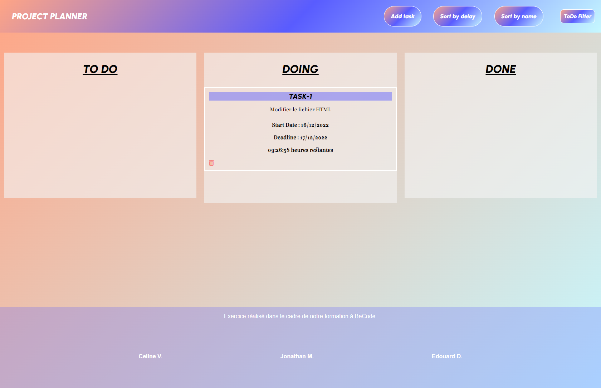

# Project Planner

Bienvenue dans ce Project Planner !

Realisé par : 
- Jonathan Manes
- Céline Verreydt
- Edouard de Romrée de Vichenet 

Plannificateur de tâches réalisé en Décembre 2022 (3 jours) dans le cadre d'un exercice rassemblant plusieurs languages tels que (HTML, CSS, SASS, JAVASCRIPT).

Fonctionnalités : 
- Possibilité de drag and drop les tâches dans les différentes sections (TO DO, DOING, DONE).
- Possibilité de filtrer les tâches selon leur statut.
- Supprimer une tâche.
- Compte à rebours jusqu'à l'échéance des tâches.

